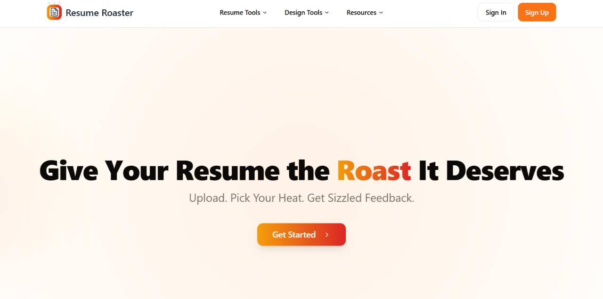

# ROASTMYCV 

<div align="center">


**Get brutally honest, AI-powered feedback on your resume**

[](https://proufrontendassignment.vercel.app/)
[](LICENSE)
[](https://reactjs.org/)
[](https://www.typescriptlang.org/)

[Features](#features) • [Tech Stack](#tech-stack) • [Getting Started](#getting-started) • [Architecture](#architecture) • [Deploy](#deployment)


https://github.com/user-attachments/assets/27bd7688-4e07-400d-b936-8e7730e29b30


</div>

---

## About


RoastMyCV is an intelligent resume analysis platform that provides **candid, constructive feedback** on your CV using Google's Gemini AI. Unlike traditional resume checkers, RoastMyCV delivers personality-driven critiques with adjustable intensity levels, helping job seekers identify weaknesses and improve their applications with actionable insights.

### Unique Features

- **Adjustable Roast Intensity**: Control how direct and critical the feedback should be (0-100%)
- **Text-to-Speech Integration**: Listen to your roast with browser-native speech synthesis (10+ voices, adjustable speed)
- **Multi-Format Analysis**: Structured sections for weaknesses, clichés, ratings, and improvement suggestions
- **Dynamic UI Components**: Animated cards, gradient themes, and smooth transitions for engaging UX
- **Secure Authentication**: Clerk-powered auth with Google OAuth support
- **Interactive Chat**: Discuss improvements with AI assistant using conversation history
- **Achievement Badges**: Earn badges as you improve your resume
- **Progress Tracking**: Monitor your resume improvement journey over time

---

## Features

### Core Functionality

| Feature | Description |
|---------|-------------|
| **AI Resume Analysis** | Powered by Google Gemini 2.0 Flash for fast, accurate critiques |
| **PDF Text Extraction** | Client-side PDF parsing using PDF.js (no server uploads needed) |
| **Intensity Control** | Slider-based roast level from "Mild" to "Savage" |
| **Smart Formatting** | Automatic section detection and structured output |
| **Audio Feedback** | Web Speech API with voice selection and playback speed control |
| **Responsive Design** | Mobile-first approach with Tailwind CSS |

### Developer-Focused Design

- **Modular Components**: 40+ reusable React components following SRP
- **Shadcn UI Integration**: Beautiful, accessible UI primitives
- **Service Layer Architecture**: Separated business logic from presentation
- **Type Safety**: Full TypeScript coverage with strict mode
- **Performance Optimized**: Code splitting, lazy loading, and memoization
- **Accessibility**: ARIA labels, keyboard navigation, screen reader support

---

## Tech Stack

### Frontend
- **Framework**: React 18 + TypeScript 5
- **Build Tool**: Vite 5 (Fast HMR, optimized builds)
- **Styling**: Tailwind CSS 3 + CSS-in-JS animations
- **UI Library**: Radix UI primitives + Shadcn components
- **Icons**: Lucide React

### Backend & Services
- **AI/LLM**: Google Gemini API (via LangChain)
- **Authentication**: Clerk (OAuth, Magic Links)
- **PDF Processing**: PDF.js (client-side)
- **Speech Synthesis**: Web Speech API (browser-native)

### DevOps & Tooling
- **Hosting**: Vercel (optimized for React/Vite)
- **Version Control**: Git + GitHub
- **Package Manager**: npm
- **Linting**: ESLint 9 + TypeScript ESLint
- **Type Checking**: TypeScript Compiler

---

## Getting Started



### Prerequisites

- **Node.js** 18+ and npm 9+
- **API Keys**:
  - [Google Gemini API Key](https://makersuite.google.com/app/apikey)
  - [Clerk Publishable Key](https://clerk.com)

### Installation

```bash
# Clone the repository
git clone https://github.com/Jeevadharshinii/ROASTMYCV.git
cd ROASTMYCV/ROASTMYCV-main

# Install dependencies
npm install

# Set up environment variables
cp .env.example .env
# Edit .env with your API keys:
# VITE_CLERK_PUBLISHABLE_KEY=your_clerk_key
# VITE_GEMINI_API_KEY=your_gemini_key

# Start development server
npm run dev
```

Visit `http://localhost:8080`

### Available Scripts

```bash
npm run dev        # Start dev server with HMR
npm run build      # Production build
npm run preview    # Preview production build
npm run lint       # Run ESLint
```

---

## Architecture

### Project Structure

```
src/
├── components/          # React components (40+ modular units)
│   ├── ui/             # Reusable UI primitives (buttons, cards, inputs)
│   ├── ResumeRoaster.tsx    # Main roasting interface
│   ├── RoastResult.tsx      # Results display with sections
│   ├── AudioFeedback.tsx    # Text-to-speech controls
│   ├── ChatContainer.tsx    # AI chat interface
│   └── ...                  # Domain-specific components
├── services/           # Business logic layer
│   ├── resumeService.ts     # PDF parsing + AI roasting
│   ├── chatService.ts       # Conversation management
│   └── audioService.ts      # Speech synthesis
├── pages/              # Route-level components
│   ├── Home.tsx            # Landing page
│   ├── Roaster.tsx         # Roasting interface
│   ├── Auth.tsx            # Authentication
│   └── ...                 # Feature pages
├── hooks/              # Custom React hooks
│   ├── use-mobile.tsx      # Responsive breakpoints
│   └── use-toast.ts        # Toast notifications
├── lib/                # Utility functions
│   └── utils.ts            # Helper functions (cn, etc.)
└── integrations/       # Third-party integrations
    └── supabase/types.ts
```

### Design Patterns

1. **Separation of Concerns**: Services handle API calls, components handle UI
2. **Component Composition**: Small, focused components composed into features
3. **Custom Hooks**: Encapsulated stateful logic (toasts, mobile detection)
4. **Type Safety**: Interfaces for props, strict null checks
5. **Error Boundaries**: Graceful error handling at component boundaries

### Key Services

#### `resumeService.ts`
- Extracts text from PDF using PDF.js
- Sends structured prompts to Gemini AI
- Cleans and formats AI responses

#### `audioService.ts`
- Manages browser speech synthesis
- Provides voice selection and speed control
- Handles text chunking for long content

#### `chatService.ts`
- Maintains conversation context
- Integrates with Gemini for follow-up questions
- Message history management

---

## Reusability & Extensibility

### Component Reusability

All UI components follow atomic design principles:

```typescript
// Example: Reusable Button with variants
<Button 
  variant="primary"           // gradient orange-red
  size="lg"                   // large padding
  className="custom-class"    // extend with Tailwind
>
  Custom Action
</Button>

// Example: Reusable Card with composition
<Card>
  <CardHeader>Title</CardHeader>
  <CardContent>Content here</CardContent>
</Card>
```

### Service Layer Benefits

- **Testable**: Pure functions, no UI coupling
- **Swappable**: Change AI provider without touching components
- **Mockable**: Easy to mock for testing
- **Cacheable**: Results can be cached at service level

### Extensibility Points

1. **Add New AI Providers**: Swap Gemini for OpenAI, Claude, etc.
2. **Additional Analysis Types**: Create new roasting modes (technical, creative)
3. **Export Formats**: Add PDF/Word export using existing result data
4. **Internationalization**: i18n-ready structure with separated strings
5. **Custom Themes**: Extend Tailwind config for brand customization

---

## Environment Variables

```bash
# Authentication
VITE_CLERK_PUBLISHABLE_KEY=pk_test_...

# AI Services
VITE_GEMINI_API_KEY=AIzaSy...
```

**Security Notes**:
- Never commit `.env` to version control
- Use Vercel environment variables for production
- Rotate API keys periodically
- Consider server-side proxy for API calls in production

---

## Deployment

### Deploy to Vercel (Recommended)

```bash
# Install Vercel CLI
npm install -g vercel

# Deploy
vercel

# Add environment variables in Vercel dashboard
# Then deploy to production
vercel --prod
```

See [DEPLOYMENT.md](DEPLOYMENT.md) for detailed instructions.

### Build for Production

```bash
npm run build
# Output: dist/ directory ready for static hosting
```

---

## Testing

```bash
# Run linter
npm run lint

# Type check
npx tsc --noEmit

# Build test
npm run build
```

---

## Contributing

Contributions are welcome! Please follow these steps:

1. Fork the repository
2. Create a feature branch (`git checkout -b feature/amazing-feature`)
3. Commit changes (`git commit -m 'Add amazing feature'`)
4. Push to branch (`git push origin feature/amazing-feature`)
5. Open a Pull Request

### Code Standards

- Use TypeScript for all new code
- Follow existing component patterns
- Add JSDoc comments for complex functions
- Ensure components are accessible (ARIA labels)
- Test on mobile and desktop breakpoints

---

## License

This project is licensed under the MIT License - see the [LICENSE](LICENSE) file for details.

---

## Acknowledgments

- **Google Gemini** for powerful AI capabilities
- **Clerk** for seamless authentication
- **Shadcn** for beautiful UI components
- **Vercel** for effortless deployment
- **Navigate Labs** for the capstone opportunity

---

## Contact

**Project Link**: [https://github.com/Jeevadharshinii/ROASTMYCV](https://github.com/Jeevadharshinii/ROASTMYCV)

**Live Demo**: [https://prouassignment.vercel.app](https://proufrontendassignment.vercel.app/)

---

<div align="center">

Made with love and fire by [Jeevadharshinii](https://github.com/Jeevadharshinii)

**Give your resume the roast it deserves!**

</div>

